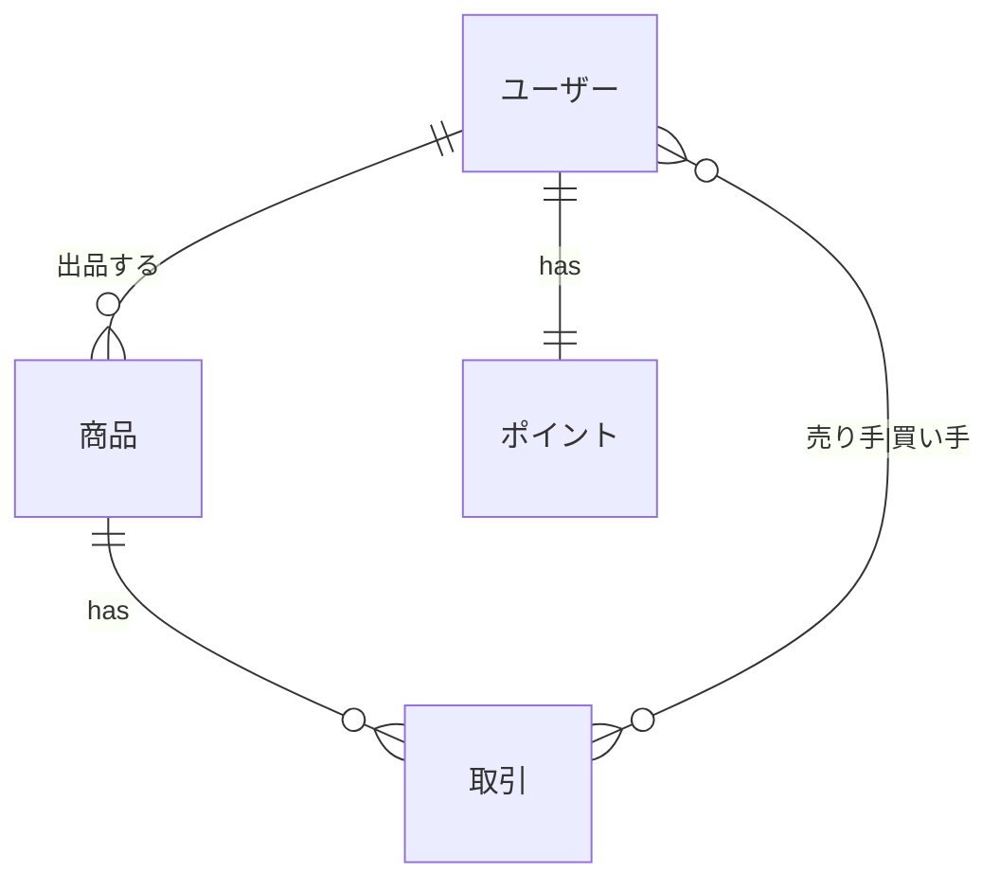

# rails-practice-swing
Rails の素振り

※API のリクエストユーザーの特定に関しては Authorization ヘッダの token などを利用するのが望ましいが、今回は body に user_id を含める形にしている。

# データモデル




# Installation

Pre-requirements

- homebrew

```sh
$ brew bundle
```

# Database

## Creation

```sh
$ bundle exec rails db:create
```

## Schema migration

apply schema

```sh
$ bundle exec ridgepole --apply -c config/database.yml -f db/Schemafile
````

export schema

```sh
$ bundle exec ridgepole --export -c config/database.yml -o db/Schemafile
```

---

* Ruby version

3.2.0

* System dependencies

* Configuration

* How to run the test suite

* Services (job queues, cache servers, search engines, etc.)

* Deployment instructions
