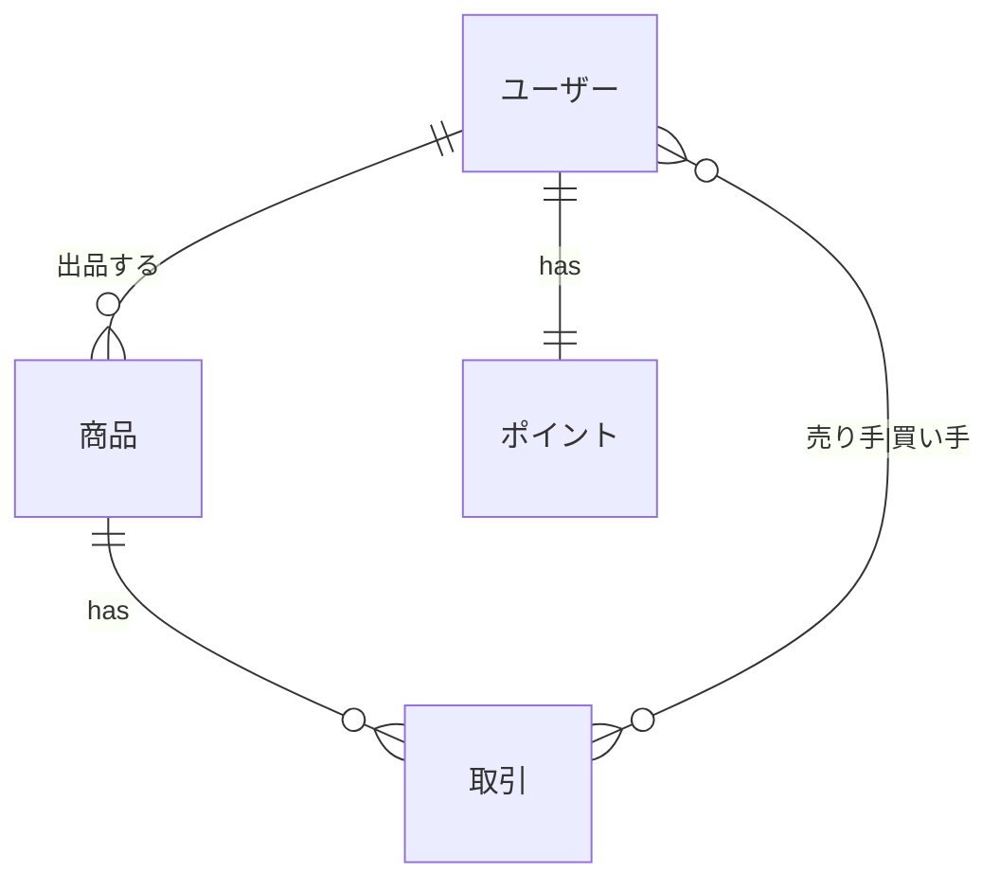

# rails-practice-swing
Rails の素振り

# データモデル


```mermaid
erDiagram
    "ユーザー" ||--o{ "商品" : "出品する"
    "ユーザー" ||--|| "ポイント" : has
    "商品" ||--o{ "取引" : has
    "ユーザー" }o--o{ "取引": "売り手|買い手"
```


# Installation

Pre-requirements

- homebrew


```sh
$ brew bundle
```
